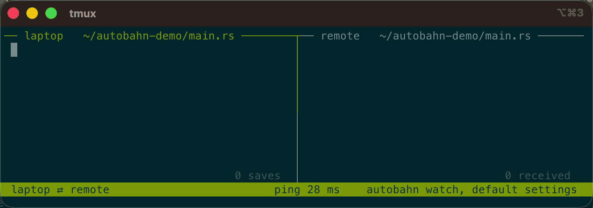
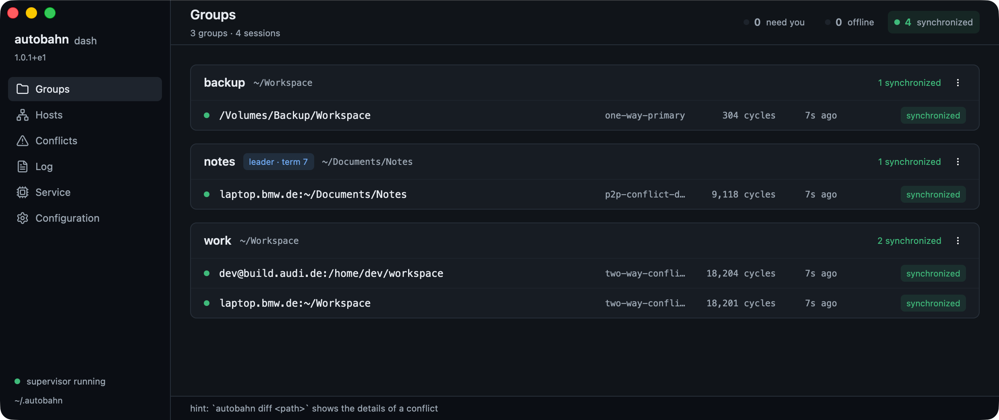

# Autobahn <picture><source media="(prefers-color-scheme: dark)" srcset="assets/sign-readme-white.svg"></picture>

[](https://github.com/fny/autobahn/releases) [](https://github.com/fny/autobahn/actions/workflows/ci.yml) [](#license) [](#system-requirements--limitations) [](docs/donations.md)

*Subsecond file sync with German precision.*

Autobahn gives you two-way sync between local and remote folders faster than you can type. Here I'm saving a file in a tree with 100k files after each key stroke, and the changes propogate instantly.



To get started, make sure your remotes are [accessible over SSH with your private key](docs/ssh.md). Then install the [desktop app](#desktop-app) or the [CLI](#getting-started-with-the-cli).

> ✨ Want to support Autobahn? Want to use Autobahn free of AGPLv3? <br />
> Simply donate to the [Justice-in-Education Initiative](docs/donations.md).

## Donors

These people bought books for people who need a second chance. Thank you!

<a href="https://github.com/ChrisMckerracher"></a> &nbsp;[Christopher Mckerracher](https://github.com/ChrisMckerracher)

**$50 of $10,000** on the [road to MIT](DONORS.md#the-road-to-mit). See [all donors](DONORS.md), or [become one](docs/donations.md).

## The Problem

- Browsing files over SSH or NFS is clunky.
- Agents can't run `--dangerously` on your local files without putting your machine at risk.
- Some sync tools require gigs of RAM for big trees, or a cloud account, or both.

Unhinged solution: keep everything in sync so editing local files is practically the same as editing remote ones.

## Why Autobahn

- **Fast as hell.** Delivers sub-30ms propagation times for updates across trees containing hundreds of thousands of files.
- **Lightweight.** Employs immutable shared-tree structures in memory, requiring significantly less RAM and idle CPU than conventional sync daemons.
- **Safe.** Choose a sync policy per group that matches your risk profile, backed by tests and bounded formal models. See [Safety](docs/safety.md) for the guarantees and their limits.
- **Reviewed to death.** GLM 5.3, KIMI 3, Astra, and Fable were used to perform correctness and security reviews.
- **Privacy first.** No cloud service, no account, no third party.


## Getting Started with the CLI

Install the CLI by hand or by telling an LLM to read [INSTALL.md](INSTALL.md):

```sh
curl -fsSL https://github.com/fny/autobahn/releases/latest/download/install.sh | sh
```

Afterwards, you need to set up your configuration. By default, the configuration is written to `~/.autobahn/config.toml`. You can edit it by hand or use the [desktop app](#desktop-app).

Each group connects one root, the primary, to one or more destinations, the replicas. Sync can be one-way or bidirectional (see [Sync Modes](#sync-modes) below). For full configuration details, see [Configuration](docs/configuration.md).

```toml
# ~/.autobahn/config.toml

[defaults]
mode = "two-way-conflict"                   # sync modes explained below
ignores = ["file:Essential.gitignore"]      # you can include ignores by file
                                            # or written explicitly
                                            # this one is from ~/.autobahn/ignores/

[groups.work]
primary = "~/Workspace"
replicas = [                                # sync targets
  "dev@build.audi.de:/home/dev/workspace",  #  - fully specified
  "laptop.bmw.de",                          #  - inherits the primary path
]
ignores = ["target", "node_modules"]        # appended to the defaults'

[groups.backup]
mode = "one-way-primary"                    # the disk is made identical
primary = "~/Workspace"
replicas = ["/Volumes/Backup/Workspace"]    #  - local paths work too
```

Finally, run `autobahn install` to install the login service or run `autobahn watch` to keep a sync running until Ctrl-C.

Make sure you have your [SSH configuration](docs/ssh.md) set up so you can connect to your remotes!

## Desktop App

Autobahn comes with a poorly tested desktop app and menu bar item, so expect bugs the way you'd expect them from Apple.

- **macOS** — open `Autobahn.app`
- **Linux** — extract the archive and run `./autobahn-app`. You need a graphical session (Wayland or X11), a Vulkan driver, and the desktop libraries the workflow lists.

Install the latest version from the [releases page](https://github.com/fny/autobahn/releases).

I highly recommend trying the app unless you plan to handle conflicts over the CLI like a masochist.



To learn more, see the [application's documentation](docs/app.md).

Make sure you have your [SSH configuration](docs/ssh.md) set up so you can connect to your remotes!

## Sync Modes

Autobahn has several sync modes with different resolution strategies.

Start with `two-way-conflict` for editing on both sides. It propagates changes in either direction and reports competing edits for you to resolve.

| Mode | Behavior |
| --- | --- |
| `two-way-conflict` | Bidirectional sync with conflict reports |
| `two-way-primary` | Favors the primary in conflicts, with deletion safeguards |
| `two-way-primary-strict` | Favors the primary, including its deletions |
| `one-way-conflict` | Reports changes on the replica that prevent a safe copy |
| `one-way-primary` (alias: `mirror`) | Makes the replica match the primary |
| `p2p-*-dangerously-experimental` | Lets a replica lead while the primary is offline |

For mode details, see [Modes](docs/modes.md) and [Conflict Resolution](docs/conflicts.md).

Read [P2P](docs/p2p.md) before P2P use.

> [!CAUTION]
> If your primary is *empty* and you sync in `mirror` mode, you will erase your replicas.

All other sync modes are not destructive on a first pass. To learn more, see [First Sync](docs/modes.md#first-sync).

## Benchmarks

Autobahn began as an effort to reduce the memory use of [Mutagen](https://mutagen.io/), which offers similar sync features, and then I got carried away.

| Measurement | Autobahn | mutagen | Ratio |
| --- | --: | --: | --: |
| Small-file edit, Chromium, 1 editor, p50 | **23.8 ms** | 6,232.2 ms | 261.9× |
| Small-file edit, 50k subset, 10 editors, p50 | **13.4 ms** | 1,809.8 ms | 135.1× |
| Peak controller memory, Chromium, 1 editor | **479 MiB** | 2,081 MiB | 4.3× |
| Idle controller CPU, Chromium | **0.1% of a core** | 49.9% | >300× |
| First sync, Chromium | **228.1 s** | 454.8 s | 2.0× |

See [Benchmarks](docs/benchmarks.md) for details.

## Safety

*Autobahn guarantees data integrity as much as possible.* Programs holding files open, network mounts, and mucking with metadata [can cause problems](docs/correctness/accepted-risks.md). Autobahn will break some programs (e.g. git) not due to correctness but rather due to syncing machine-specific files. You can use ignores to prevent these issues, and there are clever ways to keep things like [git in sync](docs/git.md).

### Empirically

I have been running this on my own fleet every day: 20 sessions across five hosts. One of them is a 13 GB, 215,000-file tree. Autobahn has also undergone a battery of tests and benchmarks including a 24-hour soak test.

### Formally

Autobahn prevents data loss through strict operational invariants:

- **Three-Way Reconciliation:** Tracks a shared ancestor to accurately distinguish deletions, modifications, and concurrent edits.
- **Atomic File Transitions:** All file writes stage content to temporary paths and swap into place using atomic filesystem operations.
- **Fail-Closed Guarantees:** Any ambiguous state, communication failure, or unexpected filesystem mutation results in a pause rather than accidental overwrites.

See [Safety](docs/safety.md) for guarantees and the related invariants in [Correctness](docs/correctness/).

## UI Goodness

In addition to the standard CLI, several user interfaces are available:

- **[Desktop App](docs/app.md):** Experimental desktop window.
- **[Menu Bar Item](docs/tray.md):** Status light and a menu without need for the full app.
- **[Terminal UI](docs/shop.md):** Interactive curses-based console monitor (`autobahn mi`).
- **[Alert Hooks](docs/alerts.md):** Event notification script support (`on_alert`).

```toml
on_alert = "~/.autobahn/on-alert.sh"   # written for you by `autobahn init`
```

None of this has undergone nearly the same level of testing as `autobahn` itself, so consider it experimental.

## AI Disclaimer

This project was heavily vibe coded, and with great vibe coding comes great responsibility. As such, I have scanned every line in this repo, run extensive soak testing, used Autobahn myself for weeks, had guardrail-free models run security scans, and put it through thousands of benchmark runs. While all of the documentation was drafted by LLMs, I've rewritten much of it. Please forgive any lingering Claudeisms.

## Contributing

- I won't accept PRs unless I know you. I prefer my slop over your slop, so instead file an issue for a bug report or (small) feature request.
- Bug reports should come with detailed context from a human or LLM.
- Feature requests should be small with high impact.
- Have a greater request? Go fork yourself. ;D

## Documentation

### Operations & Configuration

- [Installation Guide](INSTALL.md)
- [Configuration Reference](docs/configuration.md)
- [Command-Line Reference](docs/commands.md)
- [Sync Modes](docs/modes.md)
- [Ignore Rules](docs/ignores.md)
- [Conflict Resolution](docs/conflicts.md)
- [Git Repository Best Practices](docs/git.md)
- [Logging & Diagnostics](docs/logging.md)
- [State Directory Layout](docs/state.md)

### Architecture & Design

- [Architecture](docs/architecture.md)
- [Safety Guarantees](docs/safety.md)
- [Limitations](docs/limitations.md)
- [Failover P2P (Experimental)](docs/p2p.md)

### Verification & Performance

- [Benchmark Results](docs/benchmarks.md)
- [Full Benchmark Matrix](docs/benchmark-matrix.md)
- [Invariants](docs/correctness/invariants.md)
- [Accepted Risks](docs/correctness/accepted-risks.md)
- [Development Guide](docs/development.md)
- [Release Process](docs/releases.md)
- [Roadmap and Proposals](docs/wishlist.md)

## System Requirements & Limitations

- **Supported Platforms:** Linux (`x86_64`, `aarch64`) and macOS (Intel and Apple Silicon). The desktop apps are Apple Silicon only.
- **Filesystems:** Requires local POSIX filesystems. Network filesystems (NFS, SMB, CIFS) receive best-effort support only.
- **Editor Saves on macOS:** On macOS, atomic save operations (write-temporary and rename) lack immediate completion events from the kernel, occasionally requiring an extra polling cycle compared to Linux. Details are available in [Architecture](docs/architecture.md).

## License

Autobahn is dual licensed: `AGPL-3.0-or-later OR LicenseRef-Commercial`.

- **[AGPL-3.0-or-later](LICENSE)**: free for any use with copyleft caveats
- **[Donate to Justice-in-Education](docs/donations.md)** to use Autobahn free of the AGPL
