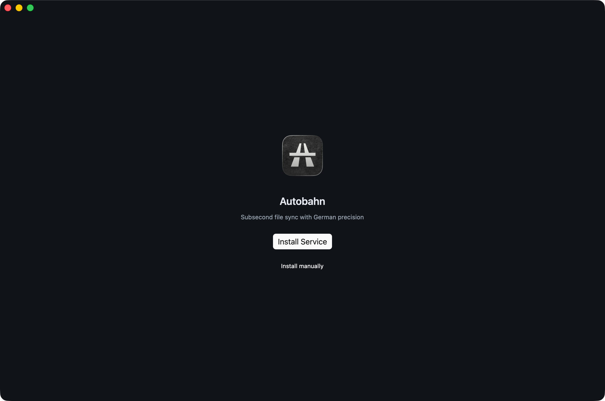
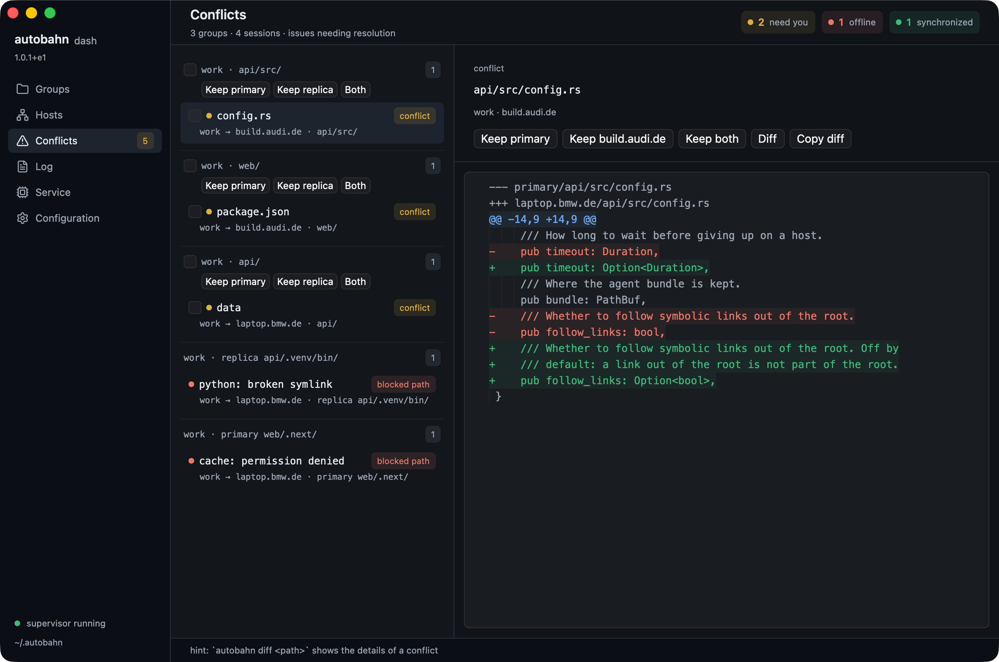
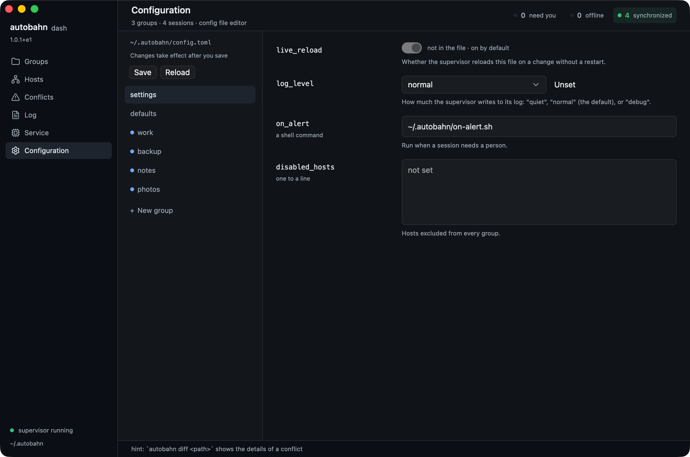
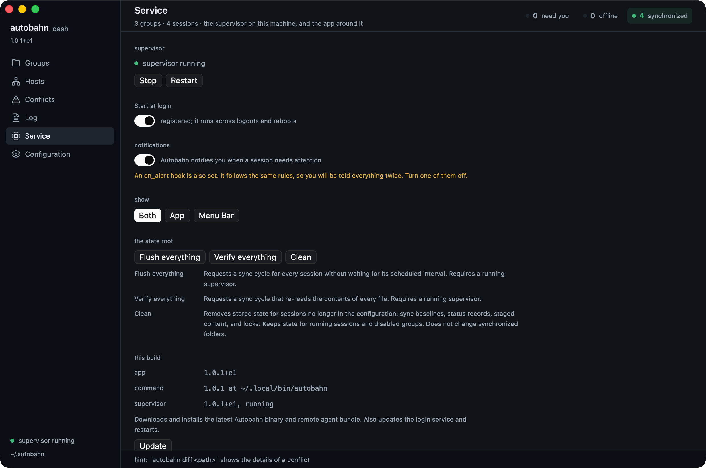

# Desktop App

The desktop app, `Autobahn.app`, is an easy way to manage your sync sessions. If the `autobahn` command isn't installed yet, the app offers to install it for you.

## Download

Download the app from the [releases page](https://github.com/fny/autobahn/releases). Links for your convenience:

- **macOS**: [Apple Silicon](https://github.com/fny/autobahn/releases/latest/download/Autobahn-macos-aarch64.zip), Intel you build
- **Linux**: [x86_64](https://github.com/fny/autobahn/releases/latest/download/Autobahn-linux-x86_64.tar.gz), [aarch64](https://github.com/fny/autobahn/releases/latest/download/Autobahn-linux-aarch64.tar.gz)

For Linux extract it and run `./autobahn-app`. You need a graphical session (Wayland or X11) and a Vulkan driver. The archive's `APT_REQUIREMENTS.txt` lists the Ubuntu or Debian packages the app uses, read off the binary when it was built, and this installs them: `grep -v '^#' APT_REQUIREMENTS.txt | xargs sudo apt-get install -y`. It's built on Ubuntu 24.04, so older distributions may be missing a new enough glibc.

## First Run



The app needs the `autobahn` command, which is a separate download. It looks beside itself first, then in `~/.local/bin`, `/usr/local/bin`, `/opt/homebrew/bin`, and your PATH.

If it finds none, a welcome screen offers to run the installer for you or to copy the shell command and run it yourself. Installer output goes to `install.log` under the state root, and the Log pane shows it as it happens.

Then set up a group before starting the service. See [Configuration](./configuration.md) and [SSH Setup](./ssh.md).

Keep the command matched to the running supervisor. A version mismatch is reported in the status area rather than left to surprise you.

## Panes


| Pane | What it does |
| --- | --- |
| **Groups** | The configured groups, their destinations, current work, and anything wrong. |
| **Hosts** | The same sessions collected by host, with host controls. |
| **Conflicts** | Disagreements and diffs, with actions to keep one side or both. |
| **Log** | The supervisor log, or installer output during setup. |
| **Service** | Program and service state, with install, start, stop, restart, and cleanup. |
| **Config** | Top-level settings, defaults, and groups, which can be added, renamed, or removed. |

Conflict actions run the same operations as the command line — see [Conflicts](./conflicts.md). The app never merges file contents. A conflict can be about a file's executable bit, a symbolic link, or a directory, so there is not always a text difference to show.

The queue groups conflicts by folder. A folder row has its own **Keep** buttons, which settle every conflict under it in one command. Tick any rows, and a bar appears with the same buttons for the ticked set; three ticked conflicts cost one scan, not three. The same file on two hosts is two rows, and each row names its host. From the Groups page, a session's "N conflicts" line has a **See them** link that opens this pane narrowed to that session; the chip at the top of the queue shows every session again.

**Diff** puts the two sides underneath, labelled by side rather than by the files actually compared:



## Editing Configuration



Edits stay in the form until you press **Save**. The editor checks them through Autobahn's own configuration loader and marks errors on the fields they belong to; an invalid configuration is never written. **Reload** reads the file again and throws away pending changes. Optional switches keep the difference between inheriting a value and setting it deliberately.

Advanced fields fold away. Experimental controls appear after five clicks on the Autobahn wordmark; what they mean and what they risk is in [Configuration](./configuration.md), [Alerts](./alerts.md), and [P2P](./p2p.md).

A running supervisor picks up a saved file through [live reload](./configuration.md#live-reload-behavior). With live reload off, restart it to apply the change.

## Choosing What Shows



In the Service pane, pick a window, [a menu bar item](./tray.md), or both. The default is both.

The choice is this machine's, and so is the notification switch above it. Both are saved in `app.toml` under the state root, which is not part of the fleet configuration:

```toml
presence = "both"   # both, window, or menubar
notify = true       # whether the app raises desktop notifications itself
```

## Notifications

The app raises desktop notifications under exactly the rules an `on_alert` hook would use: a condition has to hold before it counts, only something _joining_ the set in trouble is news, a cascade is gathered into one, and recovery is silent. See [Alerts](./alerts.md).

This does not depend on showing a menu bar item. A window with no menu bar still notifies — choosing where the app appears is not a choice about whether anything tells you a session has halted. Exactly one thing speaks per app: the menu bar item when there is one, the window when there is not.

Turn them off with the switch in the Service pane.

**Do not leave them on alongside an `on_alert` hook.** The hook follows the same rules, so both means being told everything twice. The Service pane says so when it finds a hook configured and the switch still on; turn off whichever you want less. A hook you add while the app is open is noticed within a few seconds, without a restart.

## Starting at Login

**The app does not start itself.** Add it under System Settings → General → Login Items on macOS, or your desktop's autostart settings on Linux.

**The supervisor is separate.** `autobahn install`, or the service controls in the Service pane, registers it to start at login. That is what keeps your files in sync; the app only watches it.

## Options

`--config FILE` and `--state-root DIRECTORY`. Without them the app uses the default configuration and state root (`AUTOBAHN_HOME`, or `~/.autobahn`).

## On Linux

On Linux, the menu bar item is the part most likely not to appear. The tray libraries need GTK started on the thread running the event loop, and neither GPUI nor winit provides one, so expect the window and treat the item as a bonus. A failure there leaves the window up with a one-line complaint rather than taking the app down.

## See Also

- [Configuration](./configuration.md): Settings available in the configuration editor
- [Conflicts](./conflicts.md): Conflict inspection and resolution actions
- [Alerts](./alerts.md): Notification rules and custom hooks
- [Menu Bar Item](./tray.md): The app's menu bar item and the standalone tray app
- [Terminal Interface](./shop.md): Session monitoring and control in a terminal
- [Development](./development.md#desktop-app-and-shared-text): How to build the app
- [Releases](./releases.md#signing-and-notarising-macos): macOS signing and notarization
